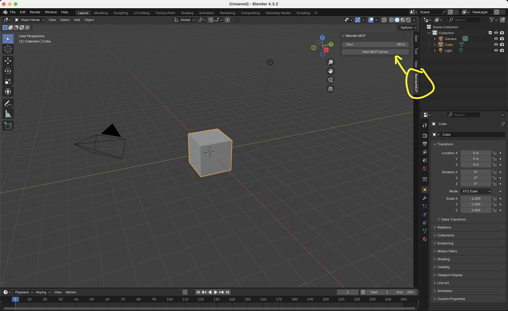

# BlenderMCP - Blender Model Context Protocol Integration

BlenderMCP connects Blender to Claude AI through the Model Context Protocol (MCP), allowing Claude to directly interact with and control Blender. This integration enables prompt assisted 3D modeling, scene creation, and manipulation.

## Features

- **Two-way communication**: Connect Claude AI to Blender through a socket-based server
- **Object manipulation**: Create, modify, and delete 3D objects in Blender
- **Material control**: Apply and modify materials and colors
- **Scene inspection**: Get detailed information about the current Blender scene
- **Code execution**: Run arbitrary Python code in Blender from Claude

## Components

The system consists of two main components:

1. **Blender Addon (`addon.py`)**: A Blender addon that creates a socket server within Blender to receive and execute commands
2. **MCP Server (`src/blender_mcp/server.py`)**: A Python server that implements the Model Context Protocol and connects to the Blender addon

## Installation


### Prerequisites

- Blender 3.0 or newer
- Python 3.10 or newer
- uv package manager: 

If you're on Mac, please install uv as
```bash
brew install uv
```
Otherwise installation instructions are on their website: [Install uv](https://docs.astral.sh/uv/getting-started/installation/)

**⚠️ Do not proceed before installing UV**


### Claude for Desktop Integration

[Watch the setup instruction video](https://www.youtube.com/watch?v=neoK_WMq92g) (Assuming you have already installed uv)

Go to Claude > Settings > Developer > Edit Config to include the following:

```json
{
    "mcpServers": {
        "blender": {
            "command": "uvx",
            "args": [
                "blender-mcp"
            ]
        }
    }
}
```

### Cursor integration

Run blender-mcp without installing it permanently through uvx. Go to Cursor Settings > MCP and paste this as a command.

```bash
uvx blender-mcp
```

**⚠️ Only run one instance of the MCP server (either on Cursor or Claude Desktop), not both**

### Installing the Blender Addon

1. Download the `addon.py` file from this repo
1. Open Blender
2. Go to Edit > Preferences > Add-ons
3. Click "Install..." and select the `addon.py` file
4. Enable the addon by checking the box next to "Interface: Blender MCP"


## Usage

### Starting the Connection


1. In Blender, go to the 3D View sidebar (press N if not visible)
2. Find the "BlenderMCP" tab
3. Turn on the Poly Haven checkbox if you want assets from their API (optional)
4. Click "Connect to Claude"
5. Make sure the MCP server is running in your terminal

### Using with Claude

Once the config file has been set on Claude, and the addon is running on Blender, you will see a hammer icon with tools for the Blender MCP.


#### Tools

- `get_scene_info` - Gets scene information
- `get_object_info` - Gets detailed information for a specific object in the scene
- `create_primitive` - Create basic primitive objects with optional color
- `set_object_property` - Set a single property of an object
- `create_object` - Create a new object with detailed parameters
- `modify_object` - Modify an existing object's properties
- `delete_object` - Remove an object from the scene
- `set_material` - Apply or create materials for objects
- `execute_blender_code` - Run any Python code in Blender
- `get_polyhaven_categories` - Get a list of categories for PolyHaven assets (HDRIs, textures, models)
- `search_polyhaven_assets` - Search for assets on PolyHaven with optional category filtering
- `download_polyhaven_asset` - Download and import a PolyHaven asset into Blender

### Example Commands

Here are some examples of what you can ask Claude to do:

- "Create a low poly scene in a dungeon, with a dragon guarding a pot of gold" [Demo](https://www.youtube.com/watch?v=DqgKuLYUv00)
- "Create a beach vibe using HDRIs, textures, and models like rocks and vegatation from Poly Haven" 
- Give a reference image, and create a Blender scene out of it [Demo](https://www.youtube.com/watch?v=FDRb03XPiRo)
- "Get information about the current scene, and make a threejs sketch from it" [Demo](https://www.youtube.com/watch?v=jxbNI5L7AH8)
- "Make this car red and metallic" 
- "Create a sphere and place it above the cube"
- "Make the lighting like a studio"
- "Point the camera at the scene, and make it isometric"

## Troubleshooting

- **Connection issues**: Make sure the Blender addon server is running, and the MCP server is configured on Claude, DO NOT run the uvx command in the terminal. Sometimes, the first command won't go through but after that it starts working.
- **Timeout errors**: Try simplifying your requests or breaking them into smaller steps
- **Poly Haven integration**: Claude is sometimes erratic with its behaviour
- **Have you tried turning it off and on again?**: If you're still having connection errors, try restarting both Claude and the Blender server


## Technical Details

### Communication Protocol

The system uses a simple JSON-based protocol over TCP sockets:

- **Commands** are sent as JSON objects with a `type` and optional `params`
- **Responses** are JSON objects with a `status` and `result` or `message`

## Limitations & Security Considerations

- The `execute_blender_code` tool allows running arbitrary Python code in Blender, which can be powerful but potentially dangerous. Use with caution in production environments. ALWAYS save your work before using it.
- Poly Haven requires downloading models, textures, and HDRI images. If you do not want to use it, please turn it off in the checkbox in Blender. 
- Complex operations might need to be broken down into smaller steps


## Contributing

Contributions are welcome! Please feel free to submit a Pull Request.

## Disclaimer

This is a third-party integration and not made by Blender.
